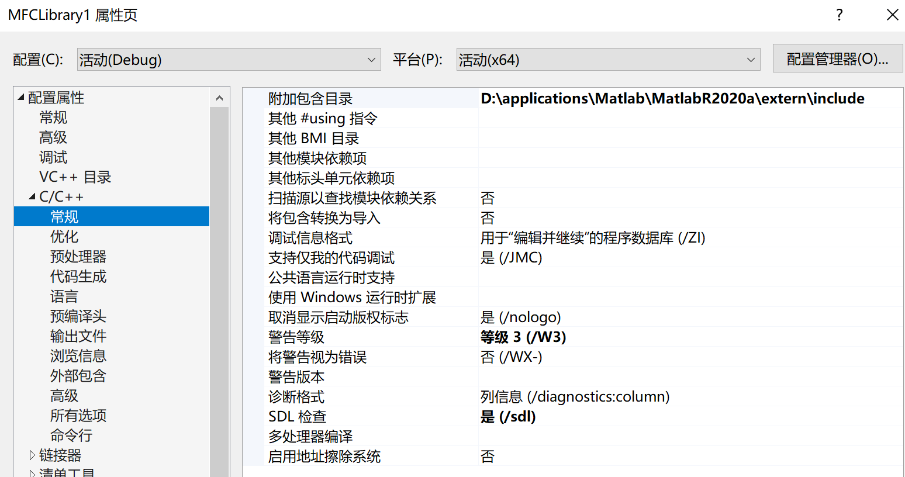
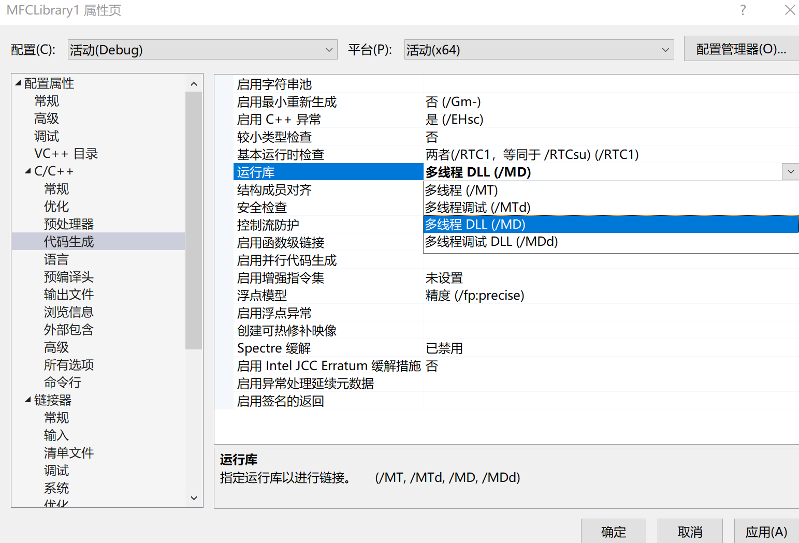
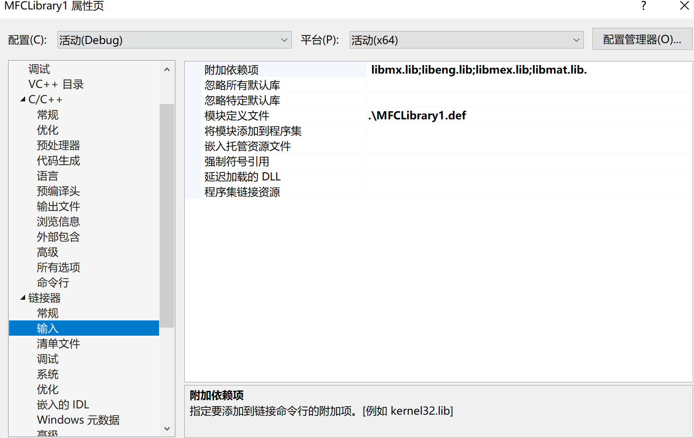
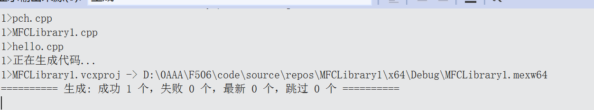
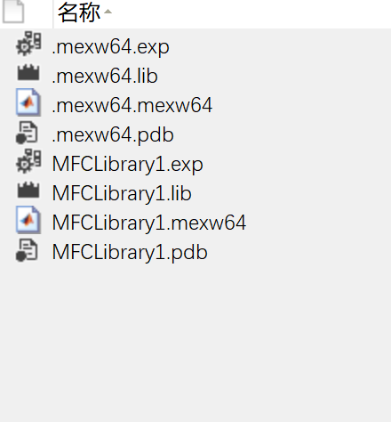

目的：C和MATLAB混合编程，提速

## 程序安装

已经安装了MATLAB R2020a和VS 2022，但是’~\Matlab\MatlabR2020a\bin\win64\mexopts‘发现并不支持VS 2022，遂卸载，重新安装VS 2019

[MatLab 与 visual studio 混合编程环境配置 - 知乎 (zhihu.com)](https://zhuanlan.zhihu.com/p/150414343)

安装VS时记得勾选SDK，MFC

[编写 Matlab mexFunction （C mex） - wenglabs - 博客园 (cnblogs.com)](https://www.cnblogs.com/arxive/p/4687766.html)

## 参考[ 这篇](https://blog.csdn.net/u010275404/article/details/46607115)进行一个hello world的尝试

- 按部就班，跟着参考博客做，直到添加完Cpp源文件这一步

- VS上方，选x64（一开始默认是x86，不改会报错）

- 修改属性

- 一切就绪，可以编译啦

按下F5

在.cpp上一级，找到x64\Debug，可以看到生成的.mexw64文件

MATLAB命令行运行

Hello！

今天就到这里吧！